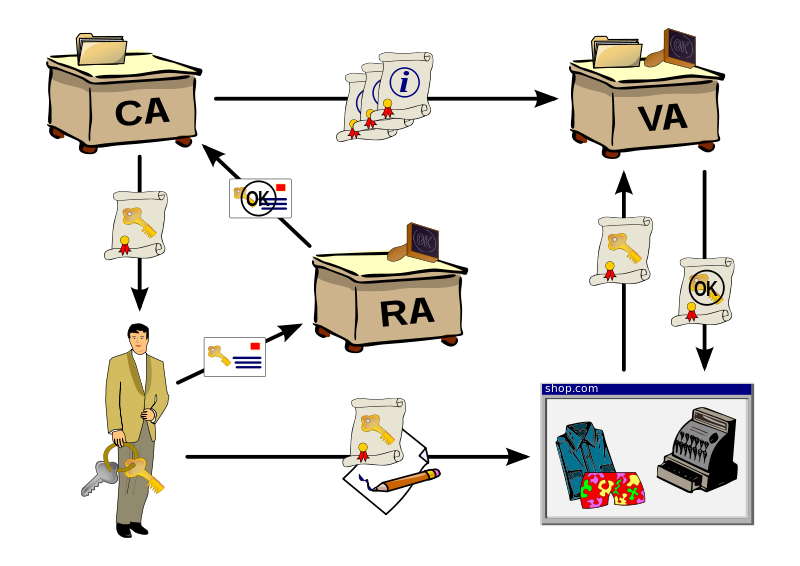

PKI，public key infrastructure，公开密钥基础架构、公钥基础建设、公钥基础设施、公开密码匙基础建设或公钥基础架构。

是一组由硬件、软件、参与者、管理政策与流程组成的基础架构，其目的在于创造、管理、分配、使用、存储以及撤销数字证书。

数字证书：一种数字标识，可以说是Internet上的安全护照或身份证明。包括公开密钥、名称、证书授权中心的数字签名、密钥的有效时间，发证机关（证书授权中心）的名称，该证书的序列号等信息，证书的格式遵循ITUT X.509国际标准。

实体，entity，PKI中涉及到的人、组织、计算机等

CA，certificate authority，数字证书认证机构。将用户的个人身份跟公开密钥链接在一起

RA，Registration Authority，注册管理中心。确保公开密钥和个人身份链接，可以防抵赖。

VA，validation authority，验证管理中心。第三方的验证中心。

CRL，Certificate revocation lists，证书废除列表，证书黑名单。

OCSP，Online Certificate Status Protocol，在线证书状态协议。OCSP克服了证书注销列表（CRL）的主要缺陷：必须经常在客户端下载以确保列表的更新。

PKCS，The Public-Key Cryptography Standards 是由美国RSA数据安全公司及其合作伙伴制定的一组公钥密码学标准，其中包括证书申请、证书更新、证书作废表发布、扩展证书内容以及数字签名、数字信封的格式等方面的一系列相关协议。
