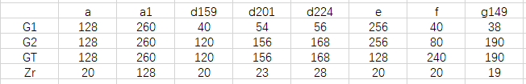

# PBC

是一个用c写的双线性对的库，其安装步骤可以参考我的另外一个项目

https://github.com/zhangzhongjun/VDB

其官网为 https://crypto.stanford.edu/pbc/

可以参考官方给的文档《pbc library manual 0.5.14》

# JPBC 

是Pairing Based Cryptography的Java版本，访问 http://gas.dia.unisa.it/projects/jpbc

* 需要引入三个jar包（在文件夹libs中）

* 需要引入params文件夹，这个文件夹中包含着初始化双线性对的参数

* 配置pom文件


```xml
 <!-- 将本地的jar包安装到仓库中，注意parse标签是clean -->
<plugin>
	<groupId>org.apache.maven.plugins</groupId>
	<artifactId>maven-install-plugin</artifactId>
	<version>2.5.1</version>
	<executions>
		<execution>
			<id>install-jpbc</id>
			<goals>
				<goal>install-file</goal>
			</goals>
			<phase>clean</phase>
			<configuration>
				<groupId>it.unisa.dia.gas.jpbc</groupId>
				<artifactId>jpbc</artifactId>
				<version>2.0</version>
				<packaging>jar</packaging>
				<file>${project.basedir}/lib/jpbc-api-2.0.0.jar</file>
			</configuration>
		</execution>
		<execution>
			<id>install-plaf</id>
			<goals>
				<goal>install-file</goal>
			</goals>
			<phase>clean</phase>
			<configuration>
				<groupId>it.unisa.dia.gas.plaf</groupId>
				<artifactId>plaf</artifactId>
				<version>2.0</version>
				<packaging>jar</packaging>
				<file>${project.basedir}/lib/jpbc-plaf-2.0.0.jar</file>
			</configuration>
		</execution>
	</executions>
</plugin>
```
```xml
<dependency>
	<groupId>it.unisa.dia.gas.jpbc</groupId>
	<artifactId>jpbc</artifactId>
	<version>2.0</version>
</dependency>
<dependency>
	<groupId>it.unisa.dia.gas.plaf</groupId>
	<artifactId>plaf</artifactId>
	<version>2.0</version>
</dependency>
```

## How To Use

```java
/**
* 双线性对
*/
final public Pairing pairing = PairingFactory.getPairing("params/curves/a.properties");
/**
* 私钥 从Zr群中随机选择一个元素 作为私钥
*/
final public Element s = pairing.getZr().newRandomElement();
```

踩过的坑：
1. 没有将params文件夹拷贝到项目中
2. 在使用元素时候没有使用duplicate()，从而使得原始值发生变化

##  JBPC中元素的大小



# SerializableElement.java

一个可以序列化的Element，JPBC中提供的Element是不可以序列化的
需要引入如下的依赖
```xml
<!-- https://mvnrepository.com/artifact/commons-io/commons-io -->
<dependency>
	<groupId>commons-io</groupId>
	<artifactId>commons-io</artifactId>
	<version>2.6</version>
</dependency>
```

# 测试时间

> 参考  ./测试时间/乘法运算/TimeTest.java

Zr域中做乘法的时间

G域中做乘法的时间

> 参考 ./测试时间/幂运算+乘法运算/*

c版本：10000 次幂运算和 10000 次乘法运算 耗时 16811.365 ms


java版本：10000 次幂运算和 10000 次乘法运算 耗时 116719 ms